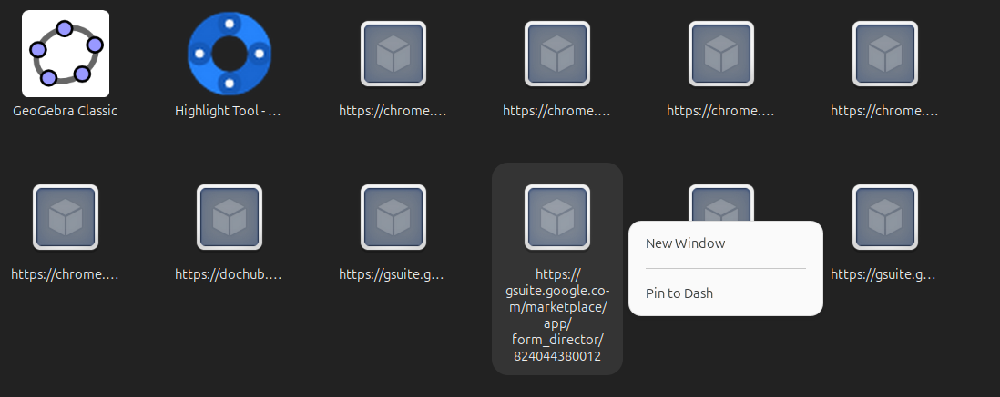

You can download the latest version of Google Chrome from their official website. 
Then double click to run the setup.

Or you can use the command-line with wget:

wget https://dl.google.com/linux/direct/google-chrome-stable_current_amd64.deb

This will download the .deb package of Google Chrome for 64-bit systems, which is standard for most modern systems. If you have a different architecture, you'll need to get the appropriate package from Google Chrome's download page.
Install Google Chrome

To install the package you've just downloaded, run the following command:

sudo dpkg -i google-chrome-stable_current_amd64.deb

# Clean chrome apps from Linux App Drawer



Those "apps" are actually **Chrome Web Shortcuts** (or Progressive Web Apps).

Whenever you use the "Create Shortcut" feature in Google Chrome (or sometimes when you install a Chrome Extension that has a web component), Chrome automatically generates a `.desktop` file in your system so you can launch that specific website like a standalone app.

### Why do they look like that?

* **Missing Icons:** The "cube" icon is the generic placeholder Ubuntu uses when it can't find a specific high-resolution icon for a shortcut. This often happens if the website didn't provide a proper manifest or if Chrome failed to download the favicon.
* **The URLs:** The labels are showing the full URL (e.g., `https://gsuite.google.com...`) because the shortcut was created without a "friendly name," or the system is defaulting to the web address as the identifier.

### How to clean them up

If you don't want these cluttering your app drawer, you can remove them manually:

1. **Via the Terminal (Fastest):**
Open your terminal and navigate to the hidden folder where these shortcuts live:
```bash
cd ~/.local/share/applications

```


Then, look for files starting with `chrome-` and delete the ones you don't want:
```bash
rm chrome-*.desktop

```


*(Note: This won't uninstall Chrome; it just deletes these specific website shortcuts.)*
2. **Via Chrome:**
Type `chrome://apps` into your Chrome address bar. You should see the same list there. You can right-click any of them and select **"Remove from Chrome"** to delete the shortcut.
3. **Via a Menu Editor:**
If you prefer a visual way to manage your app drawer, install **Main Menu (Alacarte)** or **MenuLibre** from the Ubuntu Software Center. These tools allow you to hide or delete any entry in your app list with a single click.

Would you like me to show you how to hide these without deleting them, or help you find the specific folder using the file manager?