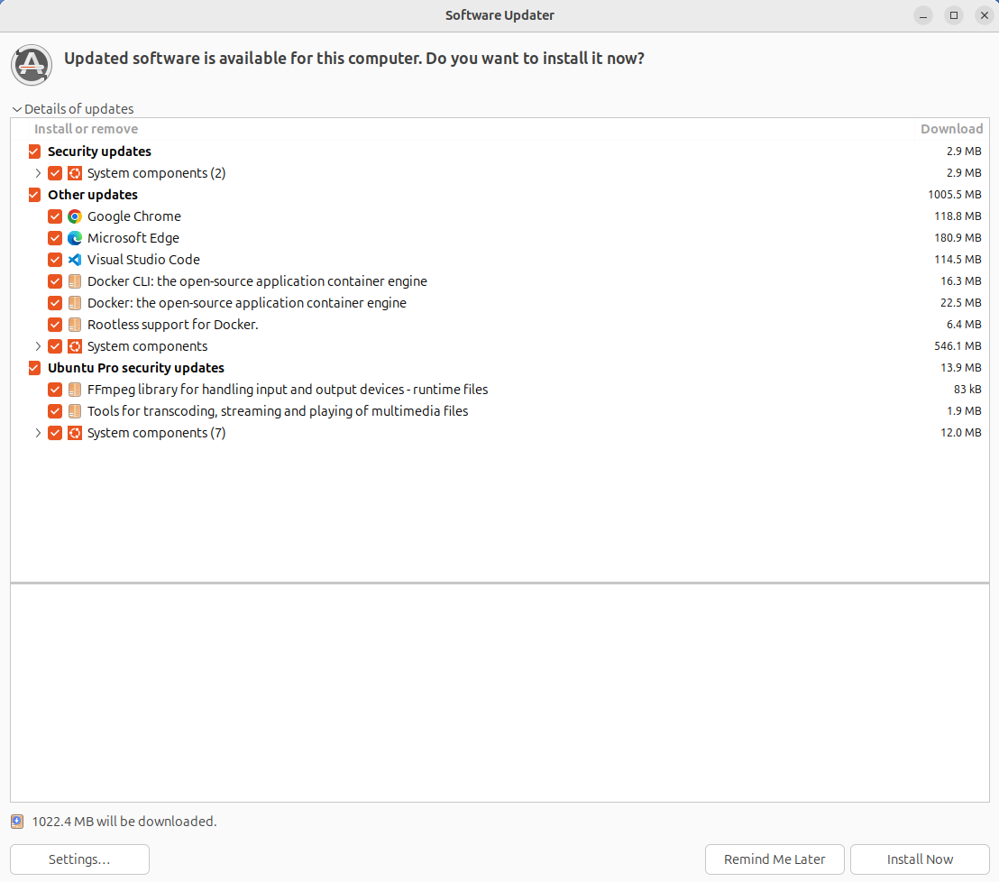
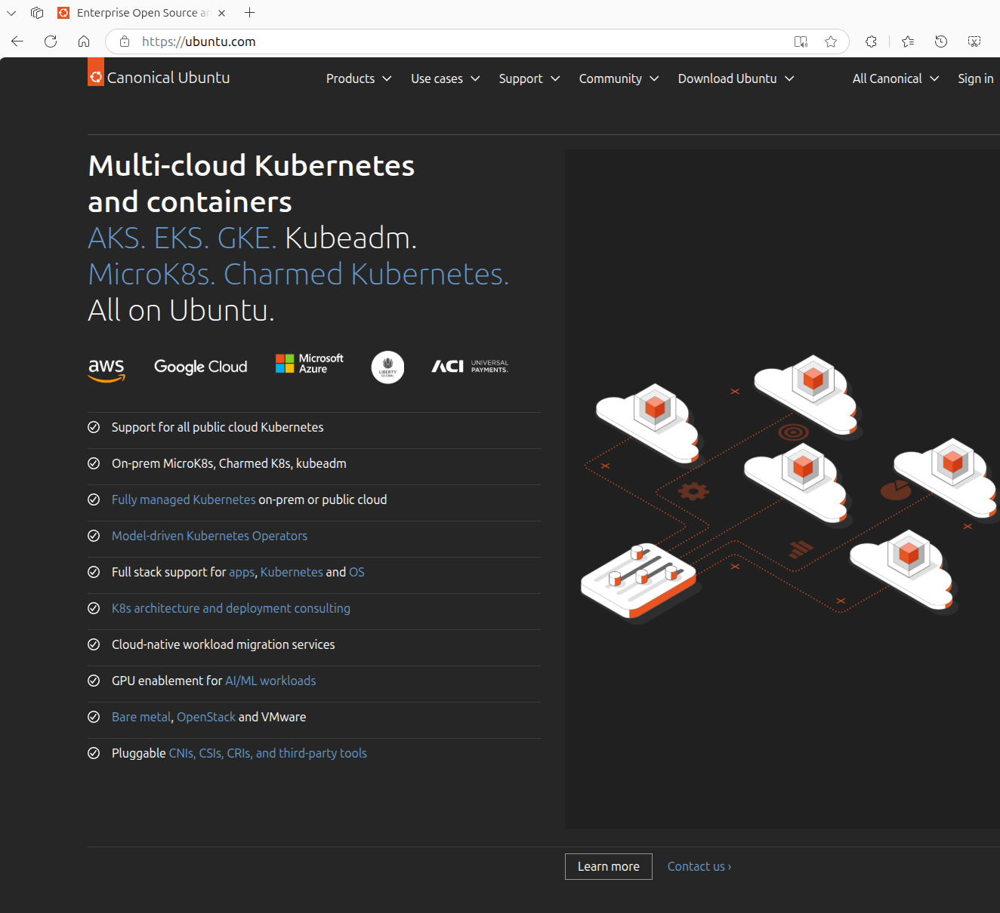

## Special Notes

### 1. Linux manages all application updates centrally

### 2. Ubuntu studio comes pre-installed with tons of free multimedia software

### 3. Linux powers most cloud infrastructure

Setting up Ubuntu alongside Windows 11 or 10 is the best way to get the power of Linux without losing your Windows environment. This setup is called "dual-booting." Here is your updated, step-by-step guide tailored for both versions of Windows!

## Your Guide to Dual-Booting Ubuntu with Windows 11/10

This guide covers everything from prepping your hard drive to choosing your OS when you flip the power switch.

---

### What You'll Need (Requirements):

1. **A Computer with Windows 11 or 10 Installed:** Ensure your system is up to date.
2. **Ubuntu ISO Image:** Go to [ubuntu.com/download/desktop](https://ubuntu.com/download/desktop).
* **LTS (Long Term Support):** **Highly Recommended.** It’s the most stable and receives security updates for years.

3. **USB Stick (8GB or larger):** This will be your "installer." **Warning:** Everything on this USB will be erased.
4. **Rufus Software (Free):** To turn the ISO file into a bootable USB.
5. **Important:** **Backup Your Important Files!** While this process is standard, moving partitions always carries a small risk. Save your documents to an external drive or cloud storage first.

---

### Step 1: Prepare Windows 11/10

We need to make room for Ubuntu by shrinking the space Windows currently uses.

#### 1.1 Create Free Space (Shrink Partition)

1. **Open Disk Management:** Right-click the **Start button** and select **Disk Management**.
2. **Identify Your Main Drive:** Look for your **(C:)** drive.
3. **Shrink the Volume:** * Right-click the **(C:)** partition and select **Shrink Volume...**
* **How much space?** Enter the amount in MB. 1024MB = 1GB.
* **Recommendation:** Use at least **50,000 MB (50GB)** for a comfortable experience.
* Click **Shrink**.

4. **The Result:** You will now see a block of black space labeled **"Unallocated."** Leave it exactly like that.

#### 1.2 Disable Fast Startup

Windows "locks" the hard drive during a fast shutdown, which can prevent Ubuntu from installing correctly.

1. Open the **Start Menu**, search for **Control Panel**, and open it.
2. Go to **Hardware and Sound > Power Options**.
3. Click **Choose what the power buttons do**.
4. Click **Change settings that are currently unavailable** at the top.
5. Uncheck **Turn on fast startup (recommended)** and click **Save changes**.

---

### Step 2: Create the Bootable USB

1. Download **Rufus** from [rufus.ie](https://rufus.ie).
2. Plug in your USB stick and open Rufus.
3. **Device:** Select your USB stick.
4. **Boot selection:** Click **SELECT** and choose the Ubuntu `.iso` file you downloaded.
5. **Partition scheme:** * For almost all Windows 11 and modern Windows 10 PCs, select **GPT**.
* **Target system** should stay as **UEFI (non CSM)**.

6. Click **START**. If asked to write in "ISO Image mode," click **OK**.

---

### Step 3: Boot from USB

1. Keep the USB plugged in and **Restart** your PC.
2. As soon as the screen lights up, tap your **Boot Menu Key** repeatedly.
* *Common keys:* **F12** (Dell/Lenovo), **F9** (HP), **F8** (Asus), or **F11/F12** (Acer).

3. Select your USB stick (often labeled **UEFI: [USB Brand Name]**) and press **Enter**.

---

### Step 4: The Ubuntu Installation

1. **Try or Install:** Select **"Try or Install Ubuntu"** from the menu.
2. **Welcome:** Select your language and click **Install Ubuntu**.
3. **Updates:** Select **"Normal installation"** and check the box for **"Install third-party software for graphics and Wi-Fi."** This is vital for drivers!
4. **Installation Type:** This is the most important part.
* Look for the option: **"Install Ubuntu alongside Windows Boot Manager."**
* **Select this.** It will automatically detect the "Unallocated Space" you made in Step 1.

5. **User Setup:** Enter your name, a name for your PC, and a **strong password**. You will need this password every time you install software in Ubuntu!

---

### Step 5: Finishing Up

1. The installation will run. Once it's done, click **Restart Now**.
2. **Remove the USB:** When you see a message on a black screen, pull out the USB drive and press **Enter**.
3. **The GRUB Menu:** Now, every time you start your computer, a menu will appear:
* **Ubuntu:** Boots your new Linux system.
* **Windows Boot Manager:** Boots your Windows 11/10 system.

**Success!** You’ve officially entered the world of dual-booting.

